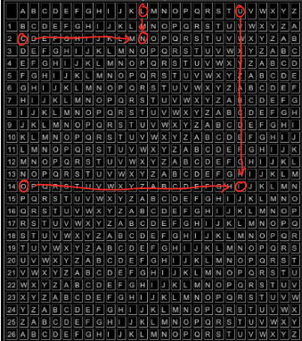
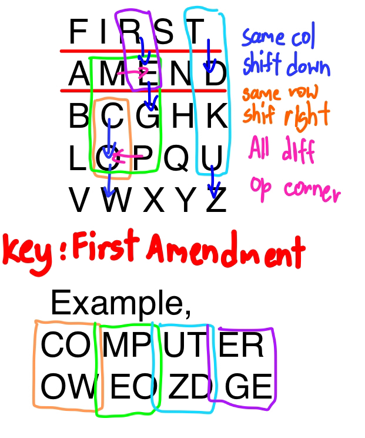
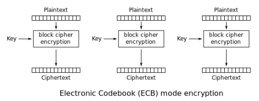
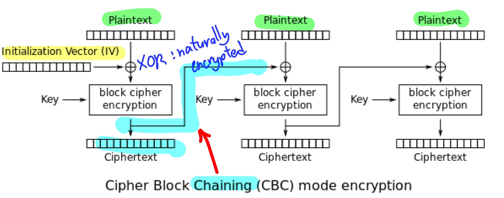
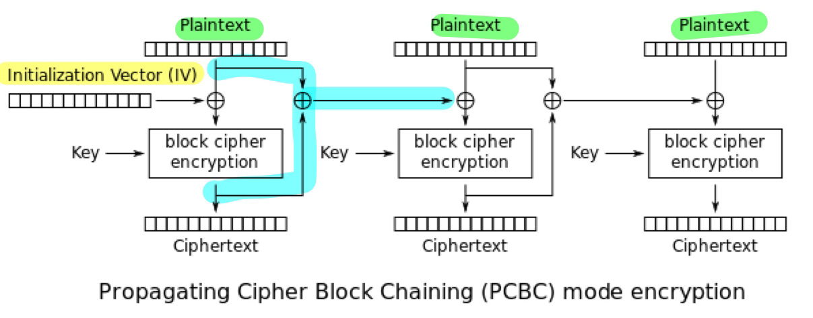
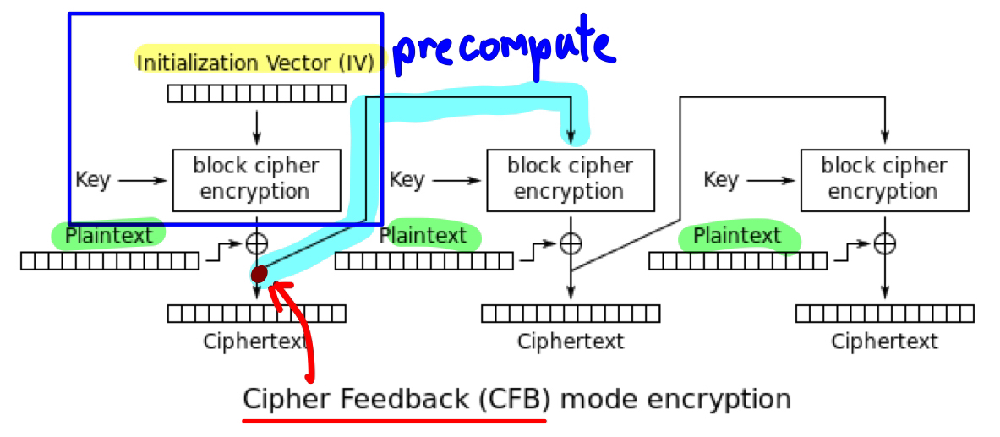
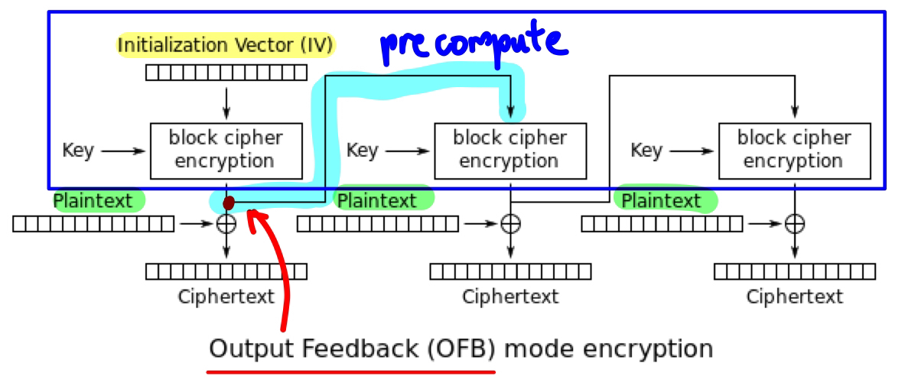
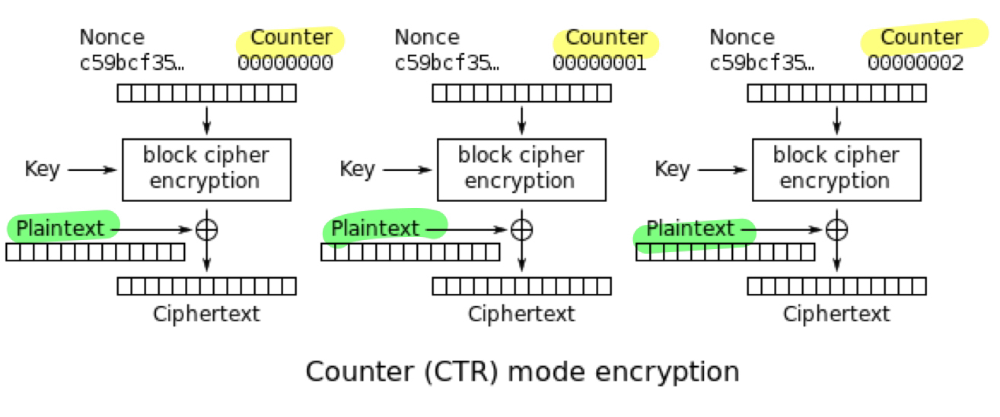

# Integrity & Basic Encryption

## Core Concepts
- **Integrity**: State of being whole, complete, and unaltered.  
  → In data, means information remains accurate and unchanged.  
- Integrity sometimes called **Authenticity** so can be refered as “fourth A” in security (after Authentication, Authorization, Accounting).  
- **Trust**: Foundation of all security systems. Decide what and who to trust (Processor, Developer, SW).  

## Minimizing Trust - Becase Reality, we cannot trust everything
- Use **sandbox** and **domain isolation** to reduce trust boundaries.  
- **Sandbox model (Java Applet)**: Runs untrusted code with limited privileges.   
- Hardware mechanisms that support Integrity (isolation):
  - **Ring levels (0–3)** for privilege separation.
    - Ring 0: Kernel mode — full hardware access.
    - Ring 3: User mode — restricted access.
    - Inner can access outer ring. Outer ring can access inner through specific method (system call)
    - Ring need -> 2 (Kernel, User) but mostly have 4, 1-2 for device driver
  - **Segmentation** : Memory divided into logical segments (code, data, stack). access outside it is blocked.
  - **Paging** : Memory divided into fixed-size blocks (pages) mapped by the OS to physical memory. Access control bits (read/write/execute) stop processes from writing into others’ pages.
  - Segmentation + Paging = isolate processes and prevent unauthorized access.
  - **Tagged memory** Each memory word or block carries a tag describing its ownership or allowed operations.

## Encryption Overview
- **Purpose:** Create Integrity & Security when no hardware support.  
- **Classical history:** 
  - Scytale (Sparta): Transposition cipher — สลับตำแหน่งตัวอักษร ไม่ได้เปลี่ยนตัวอักษรเอง
  - Caesar cipher (monoalphabetic):  แทนแต่ละตัวอักษรด้วยอีกตัวอักษรหนึ่งโดยใช้รูปแบบการแทนที่คงที่ (fixed mapping)
    - ตามที่เสริชหาได้ Caesar Cipher คือ fixed shift ด้วยซ้ำคือ เช่น 3 คือ bad -> edg
    - แบบที่อาจารย์ยกตัวอย่างในสไลด์คือ Keyword Cipher คือ
      - `abcdefgh...` standard alphabet 
      - `fodabceg...` if key = 'food' ซ้ำก็ตัดออก, key + rest of alphabet 
      - bad -> ofa
  - Weakness: Frequency analysis reveals plaintext patterns. -> เพราะในคำศัพท์อังกฤษ pattern การใช้อักษรมันค่อนข้างคงที่ เช่น e มักจะมากสุด

## Modern Encryption Types
| Type | Description | Examples |
|------|--------------|-----------|
| **Hash (Digest)** | One-way function (No key needed); fixed output size. Used for integrity checks. | MD5, SHA-1, SHA-256 |
| **Symmetric** | Same key for encryption/decryption. | Stream (RC4), Block (AES, DES) |
| **Asymmetric** | Key pair (Public/Private). | RSA, DSA |

## Symmetric Encryption Details
- **Stream Cipher**: Encrypts bit-by-bit or character-by-character, extend key to match the size of input(how to extend based on algorithm).
  - Depend On Pos : diff position & same char -> may encrypt differently
  - `LUCKYLUCK` Lucky is key, extend to LUCKYLUCK to match input size
  - `COMPUTING` Plain text
  - `NIOZSECPQ` Cipher text
  - Each pair <a,b> <b,a> will give same Char

  

- **Block Cipher**: Encrypts fixed-size blocks, construct cipher blocks
  - Depend On Group : diff group & same char -> may encrypt differently 
  - **Fixed Size:** Every block must be the exact same size (e.g., 2 letters in Playfair).
    - **The Constraint:** The system cannot process half a block.
        - **Odd Numbers:** Input has odd number of letters, add a dummy letter (e.g., `X`) to the end.
          * *Example:* `ROBOT` (5 letters) $\rightarrow$ `RO` `BO` `TX`
        - **Double Letters:** Input a pair of identical letters in the same block. You must insert a dummy letter between them.
          * *Example:* `HELLO` $\rightarrow$ `HE` `LX` `LO`

    ### The 3 Rules of Encryption
    | Shape formed by letters | The Rule | Visual |
    | :--- | :--- | :--- |
    | **Rectangle** (Diff Row, Diff Col) | Swap Corners | 🔀 Swap Horizontal |
    | **Column** (Same Column) | Shift **Down** | ⬇️ Move Down (Wrap to 1st row)|
    | **Row** (Same Row) | Shift **Right** | ➡️ Move Right (Wrap to 1st col) |

  

  - **Variations:**
    - Initial vector : Vector ที่เอามา XOR กับ plaintext เริ่มต้น
    - Padding : If block is not full -> use what (usually use 'X')
    - Chaining : ผูกแต่ละบล็อกด้วย ciphertext ก่อนหน้า
    - Feedback : นำ output จากรอบก่อน (ciphertext หรือ output ของ encryption) มาใช้สร้าง key/IV ของรอบต่อไป -> ทำ precompute ได้ถ้าใช้ output
  - **Modes of operation:**  
    - Electronic Codebook (ECB) : Block Cipher ปกติ Plaintext + Key -> Ciphertext
    - Problem : Word Frequency Analysis -> คำเดิมได้แบบเดิม -> เจอบ่อยๆ คือ word ที่ฮิต
    

    - Cipher Block Chaining (CBC) : Initial Vector + Chaining
      - เอา IV มา XOR กับ Plaintext ก่อนเข้า Block, Ciphertext ที่ได้ -> IV ของ block ถัดไป
      - Ciphertext (1) = BlockCipher(IV(0) XOR Plaintext(1))
      - IV(1) = Ciphertext (1)
      - Ciphertext (2) = BlockCipher(IV(1) XOR Plaintext(2))
    

    - Propagating CBC (PCBC) : CBC ที่ IV (n) = Ciphertext(n-1) XOR Plaintext(n-1) 
    

    - Cipher Feedback (CFB) : IV ผ่าน BlockCipher ก่อน XOR กับ Plaintext, Ciphertext เป็น IV ของ block ถัดไป
      - Ciphertext (1) = BlockCipher(IV(0)) XOR Plaintext(1)
      - IV(1) = Ciphertext (1)
      - Ciphertext (2) = BlockCipher(IV(1)) XOR Plaintext(2)
    

    - Output Feedback (OFB) : IV block ถัดไปเป็น CipherBlock(IV) -> Precompute ได้
      - Ciphertext (1) = BlockCipher(IV(0)) XOR Plaintext(1)
      - IV(1) = BlockCipher(IV(0))
    
    - Counter : ใช้ Counter Noun แทน IV อย่างอื่นเหมือน FB ไม่มี Feedback
    

## Public Key Concepts
- Encryption with **private key** can only be decrypt with **public key**, vice versa.  
- Public key is freely shareable; private key must be protected.  
- Used to combine **integrity, confidentiality, and authentication**.

### Example Scenario
> Bob → Alice  
> To ensure authenticity and confidentiality:  
> `((Message)Bob’s Private)Alice’s Public`  
> ensures only Alice can read it (others No Alice's Private), and she knows it came from Bob.

## Performance Facts
- Public key (slowest) < Block/Stream cipher < Hash (fastest).  
- All encryption can be cracked with enough power.  
- Proper **key management** is crucial -> To provide authentication & authorization.

## Security Protocols
- Combine algorithms to leverage strengths (e.g., speed + scalability).  
- **Digital Signature:** Hash + Public key = fast, verifiable authenticity. 
  - Use to check **message didnot modify (integrity)** and **come from expected sender (authenticity)**
  - `PriKey(Hash(SendMsg)) = Digital Signature`
  - `if Hash(ReceiveMsg) == PubKey(DigSig)? Trustable : Fake/Modify` 
- **HTTPS/SSL/TLS:** Combines symmetric and asymmetric encryption for key exchange and secure communication.
  - ใช้ Asymmetric ส่ง Key ของ Symmetric
  - ใช้ Symmetric ส่ง content
  - Root Cause : 
    - Symmetric encryption ต้องใช้ “คีย์เดียวกันทั้งสองฝั่ง” → ปัญหาคือ จะเอาคีย์นี้ไปให้กันยังไงโดยไม่ให้โดนดัก?
    - ถ้าส่งคีย์ออกไปตรง ๆ → คนดักระหว่างทางก็จะเห็นคีย์นั้นทันที → ไม่ปลอดภัย
    - Asymmetric encryption แก้ปัญหานี้
  - Conclusion : ใช้ Asymmetric เพื่อส่งคีย์ของ Symmetric อย่างปลอดภัย แล้วใช้ Symmetric เพื่อเข้ารหัสข้อมูลจริงให้เร็ว
  - **How we check the public key?** -> **Chain of trust** which will explain in **PKI** 
  
## Modern Cryptography Challenges
- Quantum computing, ML attacks, side-channel exploits.  
- Research directions:
  - Post-quantum cryptography.
  - Blockchain-based systems.
  - Elliptic-curve cryptography.

## Key Takeaways
- Integrity depends on both hardware and encryption.  
- No absolute security—goal is minimizing risk.  
- Continuous learning is essential in the evolving field of cryptography.

